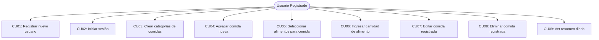
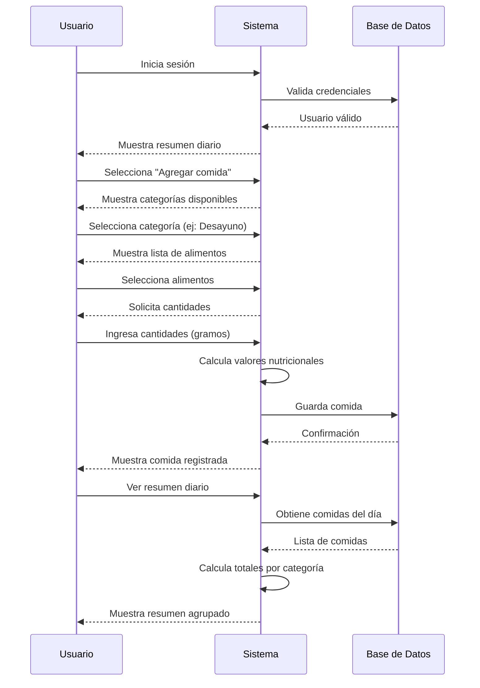

# Casos de Uso - App de Fitness y Alimentación

## Diagrama de Casos de Uso

## Listado de Casos de Uso

| #    | Nombre | Estado |
|------|--------|--------|
| CU01 | [Registrar nuevo usuario](casos-de-uso/CU01-Registrar-nuevo-usuario.md) | ✅ Adaptado |
| CU02 | [Iniciar sesión](casos-de-uso/CU02-Iniciar-sesion.md) | ✅ Adaptado |
| CU03 | [Crear categorías de comidas](casos-de-uso/CU03-Crear-categorias.md) | ✅ Nuevo |
| CU04 | [Agregar comida nueva](casos-de-uso/CU04-Agregar-comida.md) | ✅ Nuevo |
| CU05 | [Seleccionar alimentos para comida](casos-de-uso/CU05-Seleccionar-alimentos.md) | ✅ Nuevo |
| CU06 | [Ingresar cantidad de alimento](casos-de-uso/CU06-Ingresar-cantidad.md) | ✅ Nuevo |
| CU07 | [Editar comida registrada](casos-de-uso/CU07-Editar-comida.md) | ✅ Nuevo |
| CU08 | [Eliminar comida registrada](casos-de-uso/CU08-Eliminar-comida.md) | ✅ Nuevo |
| CU09 | [Ver resumen diario](casos-de-uso/CU09-Resumen-diario.md) | ✅ Nuevo |

## Flujo Principal de la Aplicación

