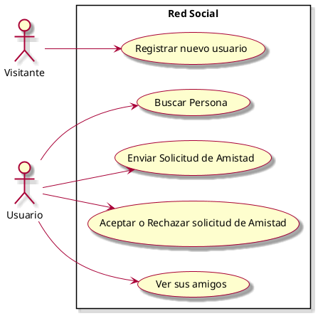

# Casos de Uso

## Diagrama de Casos de Uso

## Listado de Casos de Uso

| #    | Nombre |
|------|--------|
| CU01 | [Registrar nuevo usuario](casos-de-uso/CU01-Registrar-nuevo-usuario.md) |
| CU02 | [Iniciar sesión](casos-de-uso/CU02-Iniciar-sesion.md) |
| CU03 | [Buscar Persona](casos-de-uso/CU03-Buscar-persona.md) |
| CU04 | [Enviar Solicitud de Amistad](casos-de-uso/CU04-Enviar-solicitud-amistad.md) |
| CU05 | [Ver solicitudes de Amistad](casos-de-uso/CU05-Ver-solicitudes-amistad.md) |
| CU06 | [Aceptar o Rechazar solicitud de Amistad](casos-de-uso/CU06-Responder-solicitud-amistad.md) |
| CU07 | [Ver sus amigos](casos-de-uso/CU0-Ver-amigos.md) |
