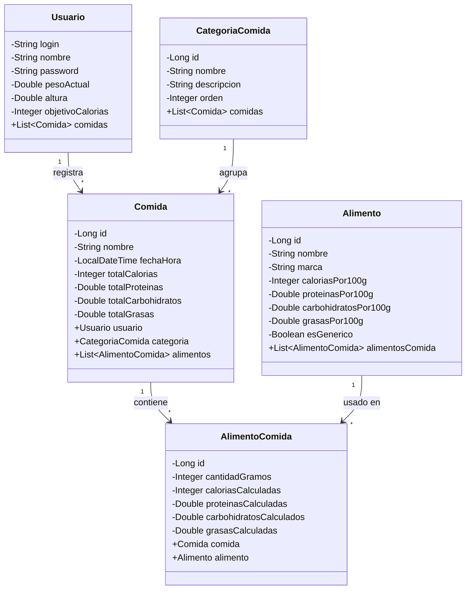

# Modelo de Clases - App de Fitness y Alimentación

## Diagrama de Clases

## Descripción de Entidades

### Usuario
Representa un usuario de la aplicación con sus datos personales y objetivos nutricionales.

### CategoriaComida
Categorías predeterminadas para agrupar comidas (Desayuno, Almuerzo, Cena, Snacks, etc.)

### Comida
Representa una comida registrada por el usuario en un momento específico. Agrupa varios alimentos y calcula totales.

### Alimento
Base de datos de alimentos con su información nutricional por cada 100g.

### AlimentoComida
Tabla intermedia que relaciona alimentos con comidas, incluyendo la cantidad específica consumida y los valores nutricionales calculados.
